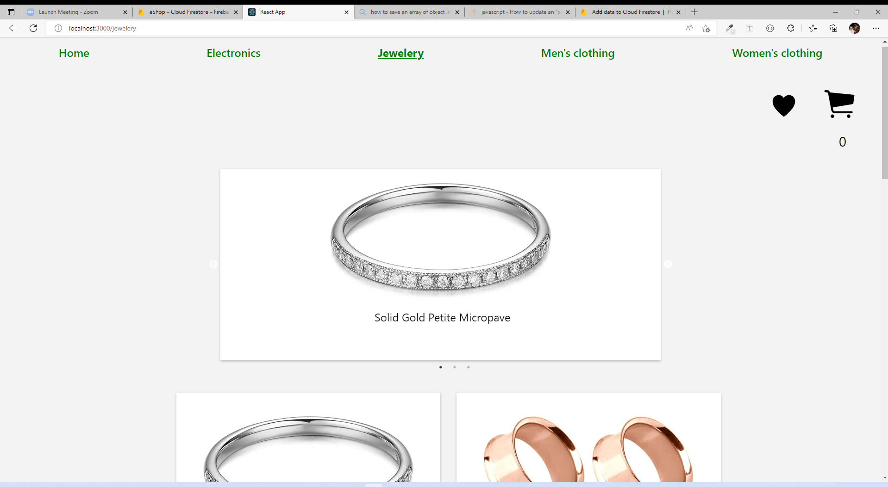
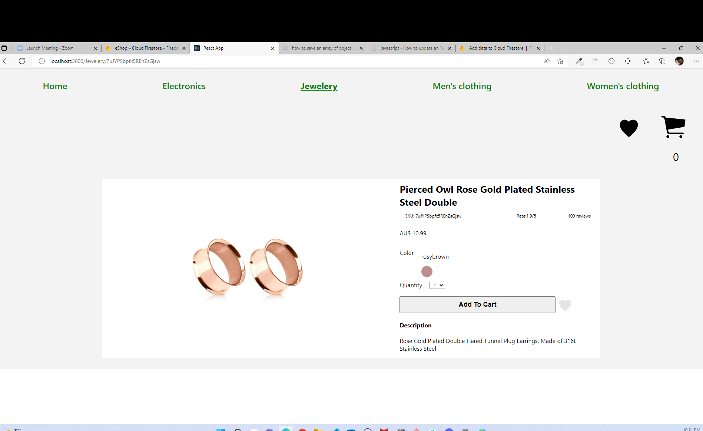
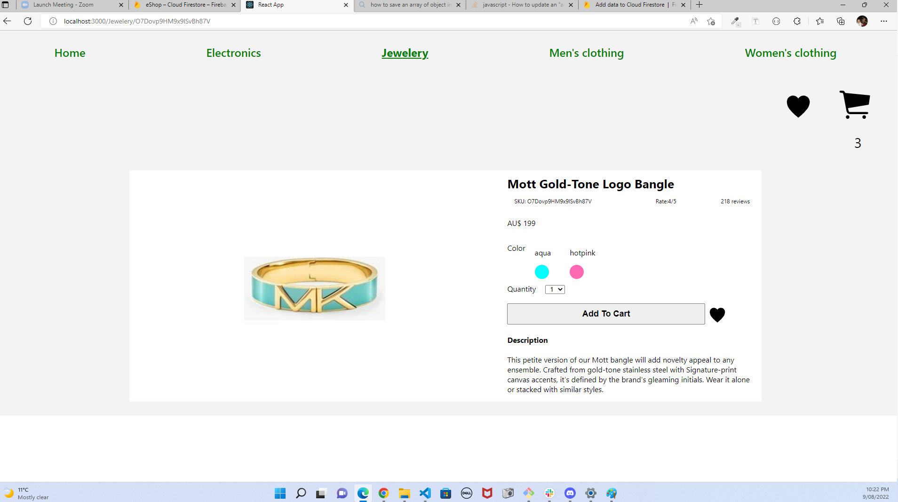
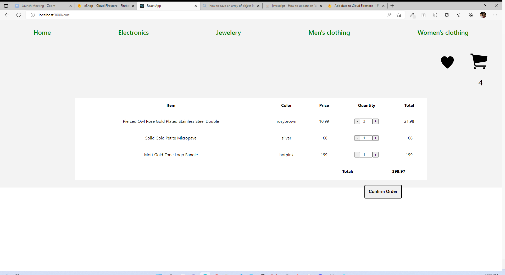

# e-Shop Website

## Images of the application

## Setup
- firebase/firestore where the items and orders details are stored.
- React-router-dom

## Deccription of the project
This is a website for selling Jeweleries. The main page has a carousel that displays snippets of the products available. Jewleries are displayed in a grid with image, title and price of each product.
When the user clicks on the products he wants, he will be navigated to the products page which gives the user more information about the product and allows him to add the quantity he wants from the product to the cart as long as the stock is sufficient. If the stoch is not enough, an alert pops up informing the user the quantity he wants is not available and the quantity in stock. The user can as well click on the favourite icon beside the quantity input to add the product in his favourite list items.
The user can explore the favourite list or the cart at anytime and go back to shopping or confirm the order.
In the cart Page, all the items details the user added are displayed. The user can still update the quantity he needs as long as there is enough stock or he can delete the item by pressing the minus button till it reaches zero than the item will disappear from the list.
After updating the quantity the user can confirm the order by pressing confirm order button. 
At this step, the items list is sent to the databse in firestore and saved under the names of items. The stock in the databse is updated as well alternatively.

## Resources

-   [Dummy JSON](https://dummyjson.com/)
-   [Fake Store](https://fakestoreapi.com/)
